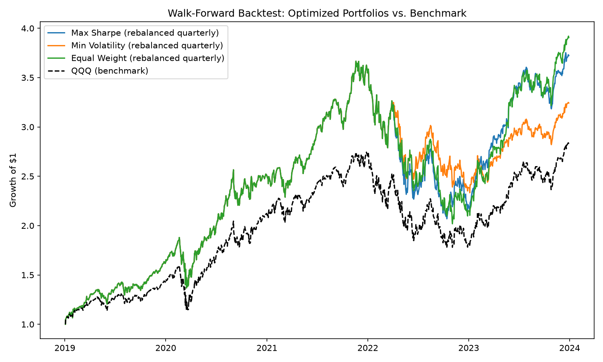
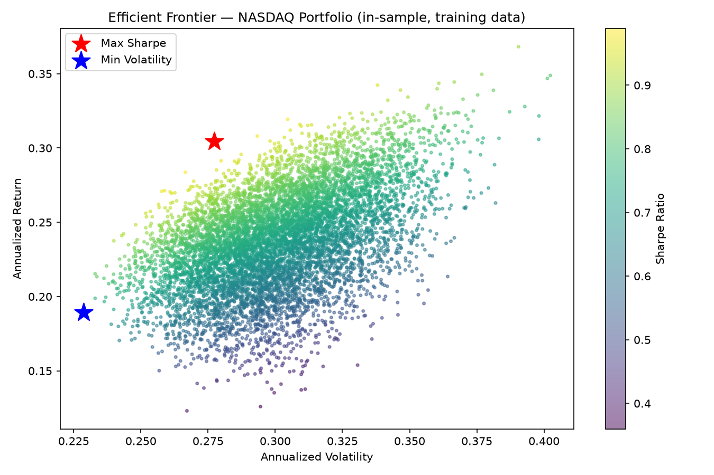

# Mean-Variance Portfolio Optimization on NASDAQ Stocks

## Research Question
Can a mean-variance optimized portfolio of NASDAQ stocks outperform a passive
benchmark (QQQ) on a **risk-adjusted** basis, out-of-sample?

## How to run
This needs internet access to pull live prices from Yahoo Finance, so run it
locally or in Google Colab (Claude's sandbox environment blocks that network
call, which is why you're running this yourself rather than me running it
end-to-end here).

```bash
pip install -r requirements.txt
python portfolio_optimization.py
```

Outputs (plots + metrics table) are written to `./output/`.

## Method
1. **Universe:** 10 NASDAQ-listed names across sectors (tech, semis, consumer
   staples) + QQQ as the benchmark. Edit the `TICKERS` list in the script to
   use your own picks.
2. **Data:** 5 years of daily adjusted close prices via `yfinance`, converted
   to daily log returns.
3. **Efficient frontier:** 8,000 randomly weighted portfolios simulated
   (Monte Carlo) to visualize the risk-return tradeoff space, with weight
   constraints (no shorting, max 25% per stock).
4. **Optimization:** `scipy.optimize.minimize` (SLSQP) solves for:
   - the **Max Sharpe Ratio** portfolio
   - the **Minimum Variance** portfolio
5. **Backtest:** Walk-forward, out-of-sample. At each quarter-end, weights are
   re-optimized using only the trailing 3 years of data (no look-ahead bias),
   then held until the next rebalance. This is compared against an
   equal-weighted portfolio and against QQQ.
6. **Evaluation metrics:** total return, annualized return, annualized
   volatility, Sharpe ratio, and max drawdown.

## Results
*(Fill this in after you run it on real data — paste your
`output/performance_metrics.csv` numbers and describe the efficient frontier
and backtest plots.)*

- Which strategy had the best Sharpe ratio out-of-sample?
- Did the optimized portfolios actually beat QQQ, or just match it with more
  complexity?
- How much did the Max Sharpe portfolio concentrate in a few names, and is
  that a risk in itself?

## Limitations (worth stating explicitly — this is what makes it read as
real analysis rather than a black box)
- Mean-variance optimization assumes returns are normally distributed and
  that historical mean/covariance are good estimates of the future — both
  are shaky assumptions, especially for individual tech stocks.
- The optimizer is sensitive to estimation error in expected returns
  (a well-known critique of Markowitz — small changes in inputs can cause
  large swings in weights). This is why the Min Variance portfolio is often
  more stable out-of-sample than Max Sharpe.
- No transaction costs or taxes are modeled; quarterly rebalancing in
  practice would erode some of the excess return shown here.
- 10 stocks is a small, concentrated universe — real portfolio construction
  would consider a much larger investable universe and sector constraints.

## Possible extensions
- Add a **Fama-French factor regression** on top of this to explain *why*
  the portfolio performed the way it did (pairs well as a second project).
- Add a rolling covariance shrinkage estimator (Ledoit-Wolf) to address the
  estimation-error problem noted above.
- Add sector-neutral constraints.

## Results

Backtest period: 2019-01-02 to 2023-12-29, walk-forward with quarterly
rebalancing (weights re-optimized each quarter using only trailing data,
no look-ahead bias).

| Strategy       | Total Return | Annualized Return | Sharpe Ratio | Max Drawdown |
|----------------|-------------:|-------------------:|-------------:|-------------:|
| Equal Weight   | 290.5%       | 31.4%              | **1.027**    | -44.9%       |
| Max Sharpe     | 272.3%       | 30.2%              | 0.999        | -43.6%       |
| Min Volatility | 224.2%       | 26.6%              | 0.933        | -36.4%       |
| QQQ (benchmark)| 182.5%       | 23.2%              | 0.834        | -35.1%       |




**Key finding:** all three stock-picking strategies outperformed QQQ on a
risk-adjusted basis — but naive equal-weighting slightly outperformed both
mean-variance optimized portfolios out-of-sample. This echoes a well-known
result in the literature (DeMiguel, Garlappi & Uppal, 2009): mean-variance
optimization is highly sensitive to estimation error in expected returns,
and that sensitivity can erase its theoretical edge over a much simpler
1/N allocation once you test out-of-sample rather than in-sample.

The Min Volatility portfolio did deliver the lowest drawdown (-36.4%),
consistent with its objective — it sacrificed some return for more
stability, exactly as designed.
